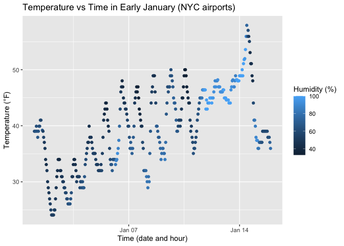

p8105_hw1_mk4996
================
Miho Kawanami
2025-09-19

## Problem 1

The dataset `early_january_weather` contains hourly meteorological data
for LGA, JFK and EWR in early January 2013.  
It has 358 rows and 15 columns.  
The important variables include:

- **time_hour**: time of measurement  
- **temp, dewp**: temperature and dewpoint in Fahrenheit  
- **humid**: relative humidity  
- **wind_dir, wind_speed, wind_gust**: wind direction (in degrees),
  speed and gust speed (in mph)

The mean temperature during this period was 39.5821229 °F.

### Scatterplot of temperature vs. time

``` r
library(tidyverse)

ggplot(early_january_weather, aes(x = time_hour, y = temp, color = humid)) +
  geom_point() +
  labs(
    title = "Temperature vs Time in Early January (NYC airports)",
    x = "Time (date and hour)",
    y = "Temperature (°F)",
    color = "Humidity (%)"
  )
```

<!-- -->

``` r
ggsave("scatterplot.pdf",  ggplot(early_january_weather, aes(x = time_hour, y = temp, color = humid)) +
         geom_point())
```

Overall, the temperature gradually increased until around January 14,
after which it dropped sharply. Humidity levels were highest around
January 12–13, as shown by the lighter blue points in the plot. This
suggests that the warmest period overlapped with the peak in humidity.

## Problem 2

### data frame

``` r
set.seed(1234)

p2_df=tibble(
  x_num = rnorm(10, mean = 0, sd = 1),
  x_logical = x_num > 0,
  x_char = c("a", "b", "c", "d", "e", "f", "g", "h", "i", "j"),
  x_fac = factor(sample(c("low","mid","high"), 10, replace = TRUE),
          levels = c("low","mid","high"))
)
```

### mean

``` r
library(tidyverse)

mean(pull(p2_df, x_num))
```

    ## [1] -0.3831574

``` r
mean(pull(p2_df, x_logical))   
```

    ## [1] 0.4

``` r
mean(pull(p2_df, x_char))
```

    ## Warning in mean.default(pull(p2_df, x_char)): argument is not numeric or
    ## logical: returning NA

    ## [1] NA

``` r
mean(pull(p2_df, x_fac))
```

    ## Warning in mean.default(pull(p2_df, x_fac)): argument is not numeric or
    ## logical: returning NA

    ## [1] NA

The means of the random sample and logical variables could be
calculated, but the means of the character and factor variables could
not.

### as.numeric

``` r
as.numeric(pull(p2_df, x_logical)) 
as.numeric(pull(p2_df, x_char))
as.numeric(pull(p2_df, x_fac))  
```

Based on the as.numeric results, logical values are converted to 0/1,
character values are treated as NA, and factors are converted to the
numbers assigned to each level. Consequently, the means of the numeric
and logical variables can be computed, whereas the means of the
character and factor variables cannot be calculated directly because
they are not numeric or meaningful.
